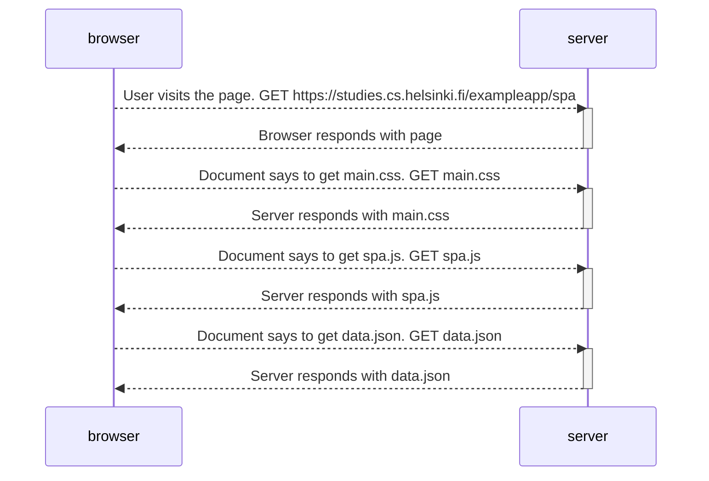

```mermaid
sequenceDiagram
    participant browser
    participant server


    browser-->>server: User visits the page. GET https://studies.cs.helsinki.fi/exampleapp/spa
    activate server
    server-->>browser: Browser responds with page
    deactivate server

    browser-->>server: Document says to get main.css. GET main.css
    activate server
    server-->>browser: Server responds with main.css
    deactivate server

    browser-->>server: Document says to get spa.js. GET spa.js
    activate server
    server-->>browser: Server responds with spa.js
    deactivate server

    browser-->>server: Document says to get data.json. GET data.json
    activate server
    server-->>browser: Server responds with data.json
    deactivate server

```