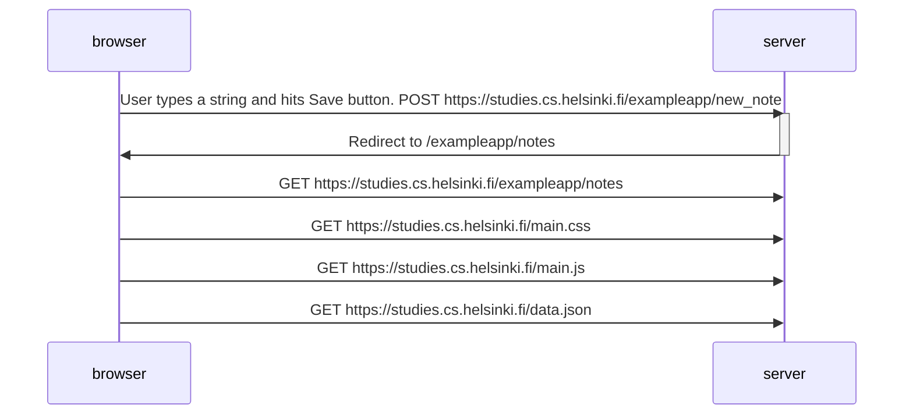

```mermaid
sequenceDiagram
    participant browser
    participant server


    browser->>server: User types a string and hits Save button. POST https://studies.cs.helsinki.fi/exampleapp/new_note
    activate server
    server->>browser: Redirect to /exampleapp/notes
    deactivate server

    browser->>server: GET https://studies.cs.helsinki.fi/exampleapp/notes
    browser->>server: GET https://studies.cs.helsinki.fi/main.css
    browser->>server: GET https://studies.cs.helsinki.fi/main.js
    browser->>server: GET https://studies.cs.helsinki.fi/data.json
```
