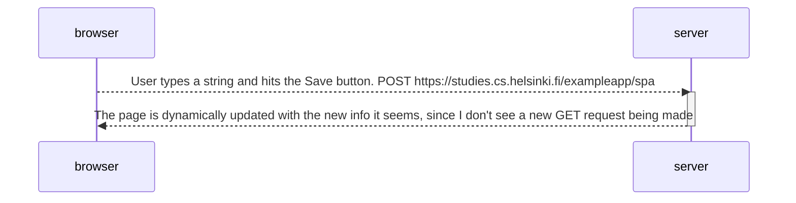

```mermaid
sequenceDiagram
    participant browser
    participant server


    browser-->>server: User types a string and hits the Save button. POST https://studies.cs.helsinki.fi/exampleapp/spa
    activate server
    server-->>browser: The page is dynamically updated with the new info it seems, since I don't see a new GET request being made
    deactivate server


```